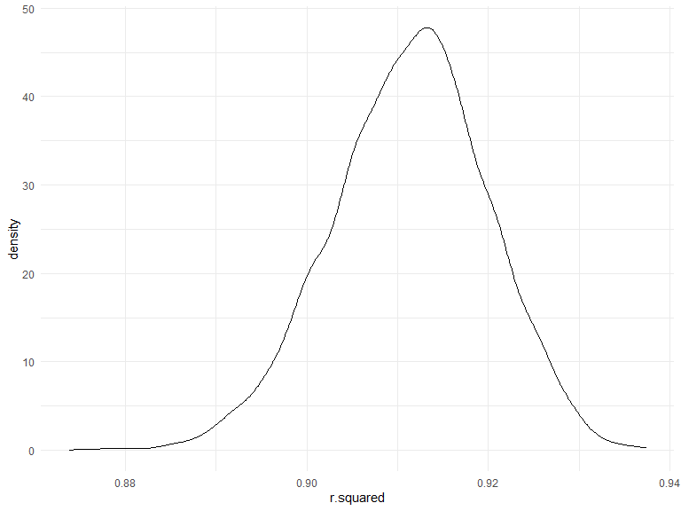
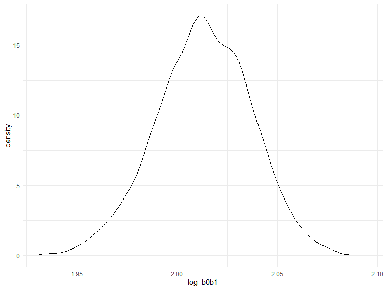

p8105_hw6_yx2711
================
Yingchen Xu
2022-11-30

# Problem 1

To obtain a distribution for $\hat{r}^2$, we’ll follow basically the
same procedure we used for regression coefficients: draw bootstrap
samples; the a model to each; extract the value I’m concerned with; and
summarize. Here, we’ll use `modelr::bootstrap` to draw the samples and
`broom::glance` to produce `r.squared` values.

``` r
weather_df = 
  rnoaa::meteo_pull_monitors(
    c("USW00094728"),
    var = c("PRCP", "TMIN", "TMAX"), 
    date_min = "2017-01-01",
    date_max = "2017-12-31") %>%
  mutate(
    name = recode(id, USW00094728 = "CentralPark_NY"),
    tmin = tmin / 10,
    tmax = tmax / 10) %>%
  select(name, id, everything())
```

``` r
weather_df %>% 
  modelr::bootstrap(n = 1000) %>% 
  mutate(
    models = map(strap, ~lm(tmax ~ tmin, data = .x) ),
    results = map(models, broom::glance)) %>% 
  select(-strap, -models) %>% 
  unnest(results) %>% 
  ggplot(aes(x = r.squared)) + geom_density()
```



In this example, the $\hat{r}^2$ value is high, and the upper bound at 1
may be a cause for the generally skewed shape of the distribution. If we
wanted to construct a confidence interval for $R^2$, we could take the
2.5% and 97.5% quantiles of the estimates across bootstrap samples.
However, because the shape isn’t symmetric, using the mean +/- 1.96
times the standard error probably wouldn’t work well.

We can produce a distribution for $\log(\beta_0 * \beta1)$ using a
similar approach, with a bit more wrangling before we make our plot.

``` r
weather_df %>% 
  modelr::bootstrap(n = 1000) %>% 
  mutate(
    models = map(strap, ~lm(tmax ~ tmin, data = .x) ),
    results = map(models, broom::tidy)) %>% 
  select(-strap, -models) %>% 
  unnest(results) %>% 
  select(id = `.id`, term, estimate) %>% 
  pivot_wider(
    names_from = term, 
    values_from = estimate) %>% 
  rename(beta0 = `(Intercept)`, beta1 = tmin) %>% 
  mutate(log_b0b1 = log(beta0 * beta1)) %>% 
  ggplot(aes(x = log_b0b1)) + geom_density()
```



As with $r^2$, this distribution is somewhat skewed and has some
outliers.

The point of this is not to say you should always use the bootstrap –
it’s possible to establish “large sample” distributions for strange
parameters / values / summaries in a lot of cases, and those are great
to have. But it is helpful to know that there’s a way to do inference
even in tough cases.

# Problem 2

Upload the `homicide-data` and create a `city_state` variable and a
binary outcome `resolved_status` to indicate whether the homicide is
solved. Omit a few `city_state` observations. Mutate a few character
variables as factor variables or numeric variable for further analysis.

``` r
homicide = read.csv("data/homicide-data.csv") %>% 
  janitor::clean_names() %>% 
  mutate(
    city_state = str_c(city, ", ", state),
    resolved_status = case_when(
      disposition %in% c("Closed without arrest", "Open/No arrest") ~ "0",
      disposition == "Closed by arrest" ~ "1"
    ),
    resolved_status = as.factor(resolved_status),
    victim_age = as.numeric(victim_age),
    victim_race = as.factor(victim_race),
    victim_sex = as.factor(victim_sex)
  ) %>% 
  filter(
    !city_state %in% c("Dallas, TX", "Phoenix, AZ", "Kansas City, MO", "Tulsa, AL")
  ) %>% 
  drop_na(victim_age)
```

Filter the analysis for whom in `Baltimore, MD` and `victim_race` is
`White` or `Black`. Fit logistic regression using `glm`.

``` r
homicide_analysis = homicide %>% 
  filter(
    victim_race %in% c("White", "Black"),
    city_state == "Baltimore, MD")

fit_logistic = homicide_analysis %>% 
  glm(resolved_status ~ victim_age + victim_sex + victim_race, family = binomial(), data = .)
  
fit_logistic = fit_logistic %>% 
  broom::tidy() %>% 
  mutate(
    OR = exp(estimate),
    LB = exp(estimate - 1.96*std.error),
    UB = exp(estimate + 1.96*std.error)
    ) %>% 
  select(term, estimate, OR, LB, UB) 

fit_logistic %>% 
  knitr::kable(digits = 3)
```

| term             | estimate |    OR |    LB |    UB |
|:-----------------|---------:|------:|------:|------:|
| (Intercept)      |    0.310 | 1.363 | 0.975 | 1.907 |
| victim_age       |   -0.007 | 0.993 | 0.987 | 1.000 |
| victim_sexMale   |   -0.854 | 0.426 | 0.325 | 0.558 |
| victim_raceWhite |    0.842 | 2.320 | 1.648 | 3.268 |

After adjusting for victim age and victim race, the odds ratio for
solving homicides comparing male victims to female victims is 0.4255117.
The 95% confidence interval for the adjusted odds ratio is (0.324559,
0.5578655).

Interpretation: The odds for solving homicides for male victims is 0.426
times the odds for solving homicides for female victims. We are 95%
confidence that the true odds ratio lies between 0.325 and 0.558.

# Problem 3

``` r
birthweight = read.csv("data/birthweight.csv") %>% 
  janitor::clean_names()
```
